# Healthcare Claims Analytics — dbt + Snowflake

**Production-grade analytics engineering pipeline** modeling synthetic healthcare claims through staging → intermediate → marts using dbt and Snowflake, with automated testing and CI/CD via GitHub Actions.

[](https://www.getdbt.com/)
[](https://www.snowflake.com/)
[](https://www.python.org/)
[](.github/workflows/dbt_ci.yml)
[](LICENSE)

---

## Overview

This project implements a complete data warehouse for healthcare payer analytics. Raw synthetic claims data (generated by [Synthea™](https://synthea.mitre.org/)) is loaded into Snowflake and transformed through a layered dbt project into analytics-ready marts that answer real payer business questions: member cost segmentation, provider performance, payer coverage mix, and chronic-condition cost burden.

**Dataset scale:** 1,163 patients · 61,459 encounters · 117,889 claims · 38,094 conditions · 10 payers · 5,056 providers · **~278K total rows.**

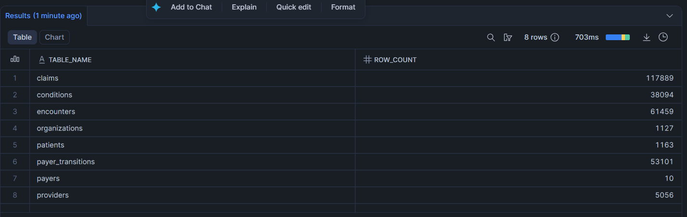

---

## Architecture

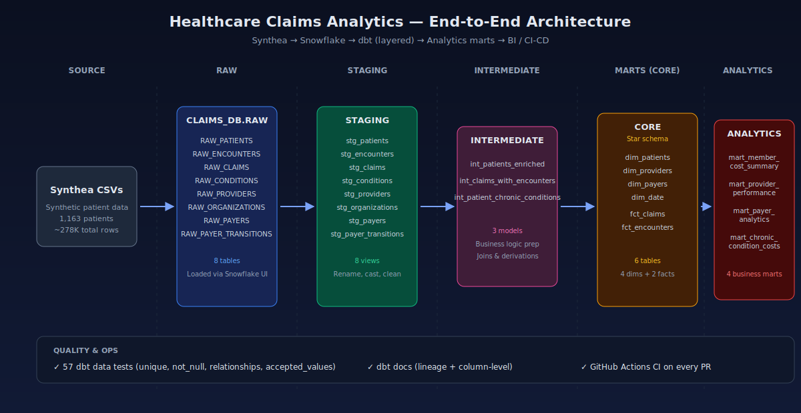

| Layer | Materialization | Purpose |
|---|---|---|
| **RAW** | Snowflake table | Landed Synthea CSVs, one-to-one with source files |
| **Staging** (`stg_*`) | View | Rename to snake_case, cast types, derive trivial fields |
| **Intermediate** (`int_*`) | Ephemeral / View | Joins, deduplication, business logic prep |
| **Marts — Core** (`dim_*`, `fct_*`) | Table | Star schema — 4 dimensions + 2 fact tables |
| **Marts — Analytics** (`mart_*`) | Table | Pre-aggregated tables answering business questions |

Layered schemas in Snowflake — each transformation tier isolated for clean lineage and access control:

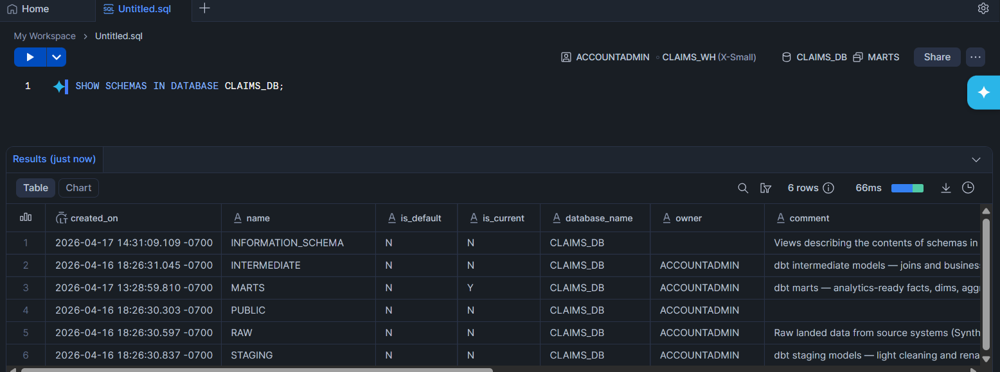

---

## Tech Stack

- **Warehouse:** Snowflake (Standard edition, single XSMALL warehouse with auto-suspend)
- **Transformation:** dbt Core 1.8.7 + `dbt-snowflake` adapter
- **Packages:** `dbt-utils` for surrogate keys and date spine
- **Orchestration-ready:** Layered, idempotent, tested — designed to drop into Airflow, Prefect, or dbt Cloud
- **CI/CD:** GitHub Actions running `dbt build` on every pull request
- **Docs:** Auto-generated dbt docs site with full column-level documentation and lineage

> **Azure note:** in production, raw CSVs would land in Azure Blob Storage and be ingested via Snowpipe from an external stage. This project uses Snowflake's internal UI loader for simplicity; the architecture is otherwise production-ready.

---

## Pipeline Layers in Snowflake

### Staging — 8 cleaned views

Light renaming, type casting, and trivial derivations. One staging model per source table.

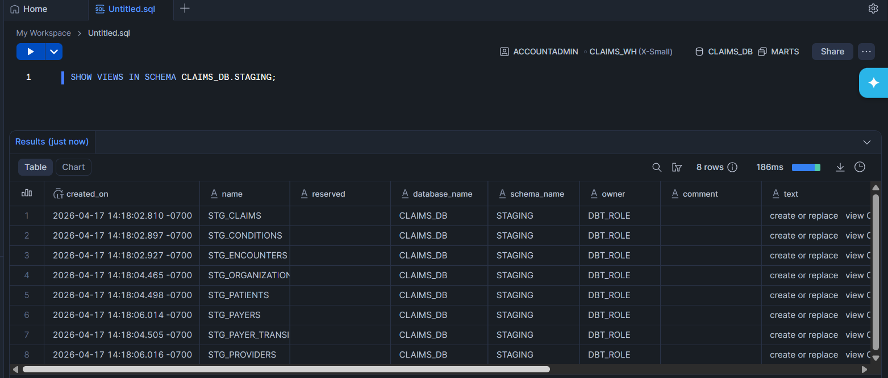

### Marts — 10 analytics-ready tables

4 dimensions, 2 facts (star schema), and 4 business-facing aggregated marts.

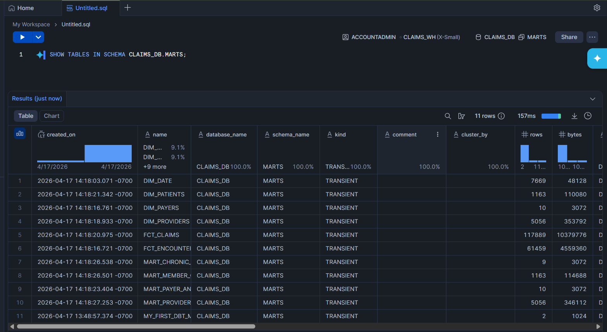

---

## Business Questions Answered

Each of the 4 analytics marts answers a core payer-analytics question:

### 1. Who are our highest-cost members?
**Mart:** `mart_member_cost_summary`
Per-patient lifetime cost summary with decile ranking, chronic condition burden, and outstanding balance exposure. Enables identification of the top-spending members driving the bulk of claim costs.

### 2. How are providers performing?
**Mart:** `mart_provider_performance`
Provider scorecard covering claims volume, unique patients served, average claim cost, payer coverage ratios, and outstanding claim rates — the metrics used in network performance reviews.

### 3. What is our payer mix and coverage picture?
**Mart:** `mart_payer_analytics`
Per-payer enrollment, encounter volume, coverage ratios, and encounter-class mix (inpatient, outpatient, emergency, wellness, urgent care, ambulatory).

### 4. Which chronic conditions drive the most cost?
**Mart:** `mart_chronic_condition_costs`
Cost burden aggregated by chronic condition cohort (diabetes, hypertension, heart failure, COPD, asthma, CKD, depression, obesity, cardiovascular disease).

---

## Sample Results

### Payer mix and coverage

From the `mart_payer_analytics` mart:

| Payer | Members | Encounters | Total Cost | Avg Coverage |
|---|---:|---:|---:|---:|
| **NO_INSURANCE** | 60 | 13,620 | $101.5M | 0% |
| **Medicare** | 195 | 8,482 | $32.3M | 60% |
| **Blue Cross Blue Shield** | 943 | 5,950 | $17.8M | 29% |
| **Aetna** | 954 | 5,767 | $16.0M | 1% |
| **Humana** | 946 | 5,635 | $14.4M | 0.3% |
| **Anthem** | 939 | 5,532 | $16.3M | 0.1% |
| **Medicaid** | 416 | 5,283 | $26.0M | 78% |

**Key insight:** uninsured encounters represent ~13K events with zero payer coverage — a $101M cost burden that downstream modeling could target for financial-assistance program outreach.

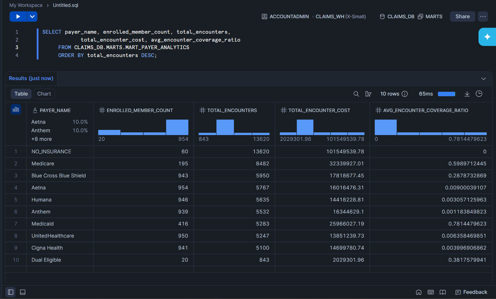

### Chronic-condition cost burden

From the `mart_chronic_condition_costs` mart — total billed amount aggregated per chronic condition cohort. Highlights where claim dollars concentrate, useful for care-management program prioritization.

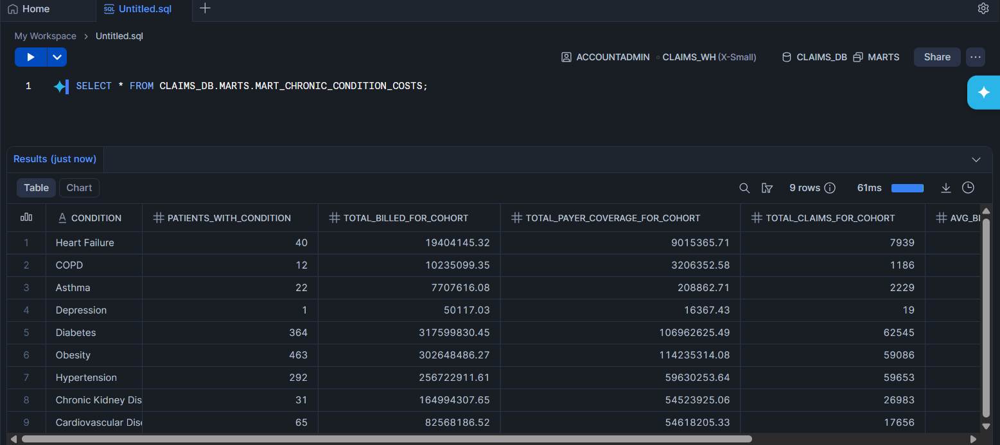

---

## Data Lineage

Auto-generated by `dbt docs`. Full DAG from raw sources through staging, intermediate, dims/facts, to analytics marts:

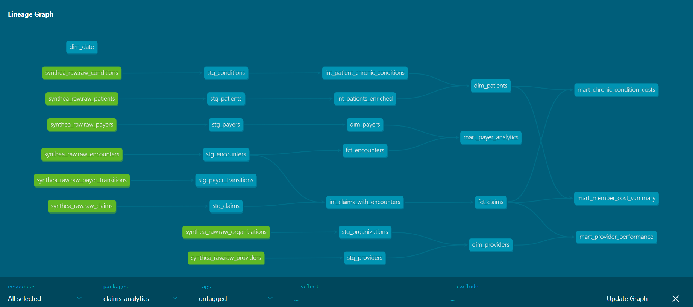

Drill into any node to see its upstream parents and downstream children:

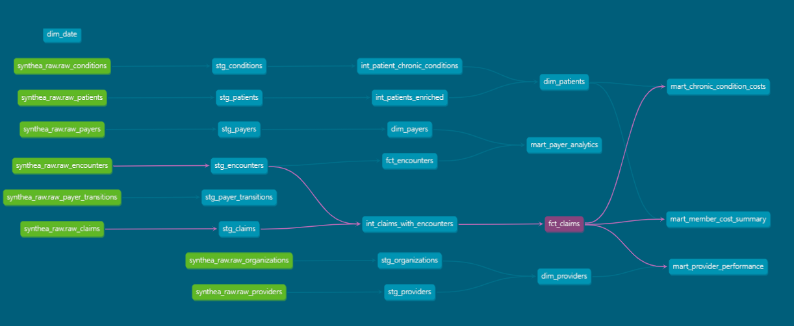

---

## Project Structure

```
claims-analytics-dbt-snowflake/
├── claims_analytics/                # dbt project root
│   ├── dbt_project.yml              # Project config with layered materializations
│   ├── packages.yml                 # dbt-utils dependency
│   ├── models/
│   │   ├── staging/                 # 8 stg_* views + sources yml + tests
│   │   ├── intermediate/            # 3 int_* models (ephemeral / view)
│   │   └── marts/
│   │       ├── core/                # 4 dims + 2 facts (star schema)
│   │       └── analytics/           # 4 business-facing aggregated marts
│   ├── macros/
│   │   └── generate_schema_name.sql # Override default schema concatenation
│   └── tests/                       # Custom singular tests (extensible)
├── snowflake/
│   ├── 01_setup_database.sql        # Warehouse, DB, schemas, role, user
│   └── 02_create_raw_tables.sql     # RAW tables matching Synthea schemas
├── .github/workflows/
│   └── dbt_ci.yml                   # CI: runs dbt build on every PR
├── data/                            # Gitignored — see data/README.md
└── docs/
    ├── architecture.svg
    └── screenshots/                 # Visual proof of every pipeline stage
```

---

## Running the Project

### Prerequisites
- Snowflake account (free trial works)
- Python 3.9+
- Git

### 1. Clone and set up Python environment

```powershell
git clone https://github.com/SoumyaShahh/claims-analytics-dbt-snowflake.git
cd claims-analytics-dbt-snowflake
python -m venv venv
.\venv\Scripts\Activate.ps1
pip install dbt-core==1.8.7 dbt-snowflake==1.8.4
```

### 2. Provision Snowflake

Run the two SQL scripts in `snowflake/` as ACCOUNTADMIN:
1. `01_setup_database.sql` — creates database, schemas, warehouse, role, and the `DBT_USER` service account
2. `02_create_raw_tables.sql` — creates 8 empty RAW tables

### 3. Load Synthea data

See [`data/README.md`](data/README.md) for download and load instructions.

### 4. Configure dbt

Run `dbt init` inside `claims_analytics/` or update `~/.dbt/profiles.yml` with your Snowflake account, user, password, role=DBT_ROLE, warehouse=CLAIMS_WH, database=CLAIMS_DB, schema=MARTS.

### 5. Verify the connection

```powershell
cd claims_analytics
dbt debug
```

Expected output — all green:

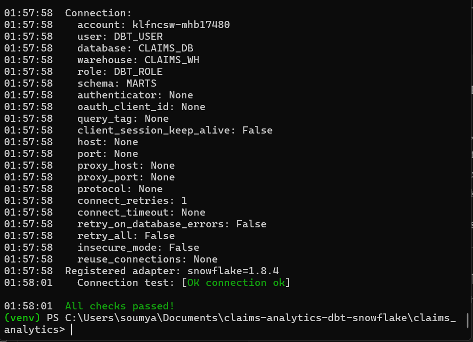

### 6. Build the warehouse

```powershell
dbt deps
dbt build
```

Expected: 19 models built and 57 tests passing in ~30 seconds.

### 7. Explore the docs

```powershell
dbt docs generate
dbt docs serve
```

Opens at `http://localhost:8080`.

---

## Testing

**57 data tests** run automatically as part of `dbt build`:

- **Uniqueness** on every primary key
- **Not-null** on all surrogate keys and required fields
- **Relationships** (referential integrity) from fact tables to dimension tables
- **Accepted values** on enum-like columns (e.g., `gender`)

All tests pass on every build:

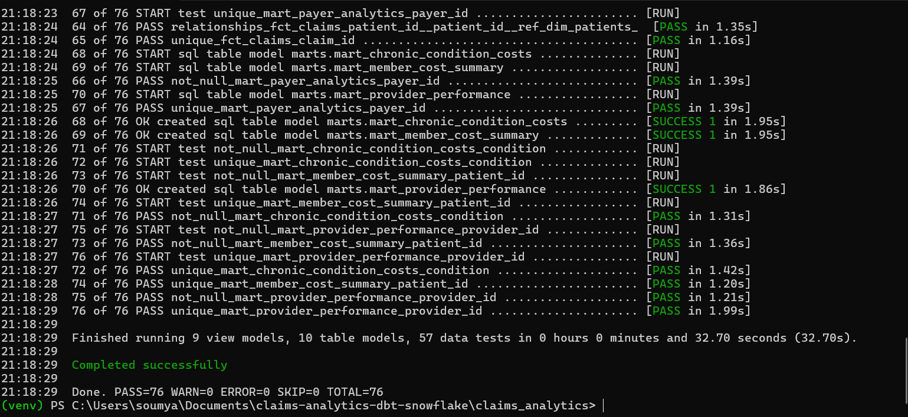

---

## Continuous Integration

`.github/workflows/dbt_ci.yml` runs `dbt build` on every pull request into `main`, catching regressions before merge. Credentials are supplied via GitHub Secrets — the workflow stays credential-free in the repo.

---

## What This Project Demonstrates

- **Layered analytics engineering** (medallion / staging-intermediate-marts pattern)
- **Star-schema dimensional modeling** (facts, dims, SCD-ready structure)
- **Data contracts** (sources, schemas, types enforced at the warehouse)
- **Automated testing culture** (57 tests guarding every model)
- **Infrastructure as code** (Snowflake provisioning checked in as SQL)
- **CI/CD for data** (GitHub Actions on dbt)
- **Domain fluency** (real healthcare / payer analytics questions, not toy aggregations)
- **Documentation discipline** (dbt docs, architecture diagram, reproducible README)

---

## About

Built by **Soumya Shah** — Data Engineer & Analyst.

[GitHub](https://github.com/SoumyaShahh)

**Background:** MS in Management Information Systems, University of Arizona · BTech in Computer Science, University of Mumbai · 3+ years in data engineering across healthcare and financial services (UnitedHealth Group, Accenture). Prior portfolio projects span AWS (Lambda, S3, Glue, Athena), SSIS, Python, SQL, Power BI, Tableau, and ML pipelines — this project fills in the modern cloud-warehouse + dbt layer.

---

## License

[MIT](LICENSE)

---

## Acknowledgments

- **Synthea™** by [MITRE Corporation](https://www.mitre.org/) — open-source synthetic healthcare data
- **dbt Labs** — analytics engineering framework
- **Snowflake** — cloud data platform
